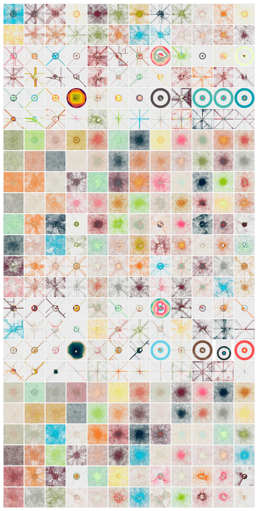

# Cities, Circles, and Cells

“Cities, Circles, and Cells” Is a generative art collection inspired by the biological growth process of Physarum slime-mold. Originally codified as a generative art script by Antonio Sánchez Chinchón in his [“Abstractions”](https://github.com/aschinchon/abstractions) R experiment, we took his exploration a bit further by performing a grid search across eight parameters controlling everything from the diffusion properties to the rotation angle of the agents.

After hours of graphical processing, we were able to generate hundreds of smile mold art abstractions. It was at this point in our journey did the inspiration for the art collection manifest itself. As we viewed the outputs, it became immediately obvious that the algorithm was generating “cities”, “circles” and “cells”.

<figure>
    

      
       
      
    

  <figcaption><em>Sample cell, circle, and city image</em></figcaption>
</figure>
  

These distinct evolutions of the same algorithm arose under the varying starting conditions initiated by the grid search procedure. When viewing the process in isolation we could further observe the relationships between the finalized patterns. Nearly all started as circles, then evolved into cities, until complexity took hold and the final cell pattern emerged. 

</img>

With a new found appreciation for the algorithm and pleasure with the art work, we curated the collection down to 99 representative pieces that capture the essence of algorithm and highlights the variation in output of the final emergent patterns. In the end we were proud and pleased to called our generative art collection “Cities, Circles, and Cells”.

</img>

